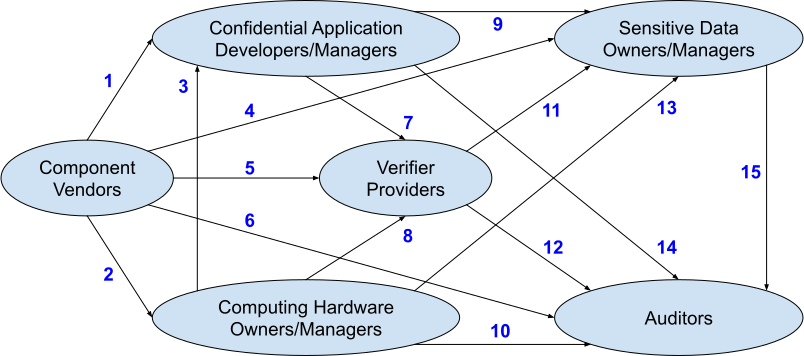

#  
# Expectations of Ecosystem Participants

# Context

In any environment employing Confidential Computing, there are several distinct classes of participants, and their relationships are generally the same across all such environments.

# Problem

This pattern sets out to list in one place the high-level requirements that various participants in the Confidential Computing ecosystem are likely to place on each other from the governance perspective.

# Solution

The table below contains the generalized summaries of expectations across each of the numbered relationships in the diagram above. Individual Governance Patterns describe these expectations in extensive detail.

| Relationship(s) | Description |
| :---- | :---- |
| **1, 2, 4, 5** | The **Component Vendors** are responsible for: <ul><li>Publishing patches and their associated Reference Values/measurements</li><li>Addressing discovered vulnerabilities in a responsible and timely fashion</li><li>Ensuring their offerings are compatible with appropriate standards, protocols, and regulations</li><li>Demonstrating trustworthiness and continuously improving the soundness of their offerings through sustained security efforts involving state-of-the-art scientific methods and third-party security reviews</li><li>Operating the manufacturing process behind their products in accordance with appropriate regulations and certification requirements</li></ul> |
| **3, 13** | **Computing Hardware Owners/Managers** are responsible to the **Confidential Application Developers/Managers** and **Confidential Data Owners/Managers** for: <ul><li>Timely deployment of patches supplied by the **Component Vendors**</li><li>Operating the hardware in their possession in accordance with relevant specifications from the **Component Vendors** (e.g., ensuring physical security, secure configuration, etc.)</li><li>Secure decommissioning of the hardware in keeping with the **Component Vendors**’ recommendations</li></ul> |
| **6, 10, 12, 14, 15** | All parties may be required to provide evidence in support of satisfying the regulatory and contractual obligations listed in various Control Specifications to the **Auditors**. |
| **7** | The **Confidential Application Developers/Managers** are responsible to the **Verifier Providers** for supplying the up-to-date measurements of code and configuration that would subsequently be deployed to perform confidential computations. |
| **8** | **Computing Hardware Owners/Managers** are responsible to the **Verifier Providers** for: <ul><li>Timely coordination and deployment of hardware patches following their publication by the **Component Vendors**</li></ul> |
| **9** | The **Confidential Application Developers/Managers** are responsible to the **Confidential Data Owners/Managers** for: <ul><li>Development of Confidential Applications in keeping with appropriate current best practices</li><li>Secure deployment of the Confidential Applications</li><li>Timely notification of breaches, discovered security vulnerabilities in their Confidential Applications, and other security incidents</li><li>Timely development and deployment of patches for functionality defects and security vulnerabilities</li></ul> |
| **11** | The **Verifier Providers** are responsible to the **Confidential Application Developers/Managers** for: <ul><li>Operating their offerings in a highly available fashion</li><li>Ensuring peer isolation in situations involving multi-tenancy</li><li>Timely incorporation of patches and other recommendations, such as secure configuration, from the **Component Vendors**</li><li>Complying with legal disclosure obligations regarding breaches and other security incidents</li><li>Collecting and securely storing all logs and evidence related to service operation, histories of policies and changes, etc.</li></ul> |
