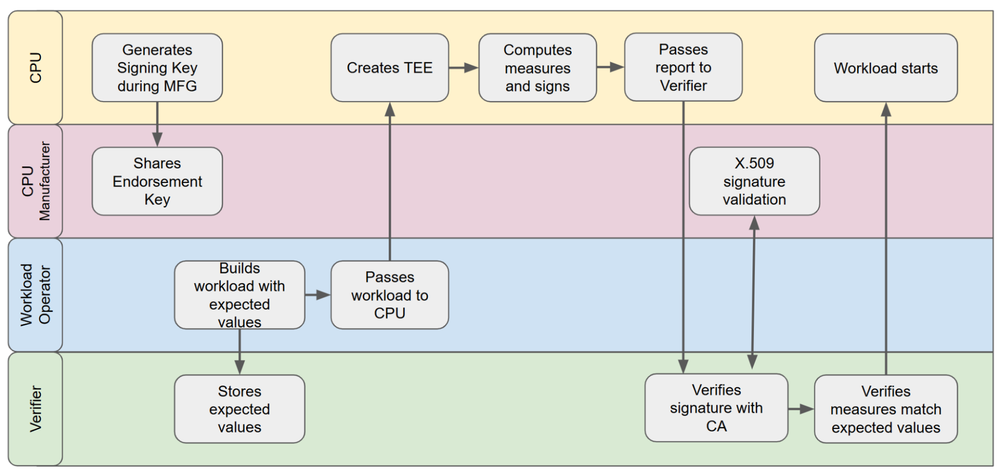

#  Verifier Governance

# Context

Confidential Computing requires a trusted Verifier **\[1\]**. This document covers the governance requirements inherent in operating trustworthy Verifiers. A properly governed Verifier must be subjected to a set of Confidential Computing-specific Control Objectives in order to satisfy the requirements of each Persona **\[3\]**.

# Problem

A Verifier plays a crucial role in Confidential Computing – it is the ultimate arbiter of the identity and security state of every Confidential Computing workload. A compromised Verifier may lead to the loss of assets intended for a Confidential Computing deployment in the same manner that the compromise of a Hardware Security Module or Certificate authority would lead to insecure reliance and loss of assets. It is therefore extremely important to properly govern Verifier instances to ensure and assess their trustworthiness.

The discussion that follows will refer to the following Roles and Assets inherent in the Verifier space.

## Roles

| Role | Description and Trust Relationships |
| :---- | :---- |
| **Verifier Hardware Operator (VHO)** | The Cloud Service Provider (CSP) or a similar entity that owns and operates the hardware on which the Verifier Service runs. |
| **Verifier Service (VS)** | The entity that operates and bears responsibility for the secure operation of a service to assess attestations. The VS may support a single customer or multiple customers defined here as Verifier Tenants. The VS trusts[^1] the VHO and may choose to minimize that trust by operating its Verifier Service Software within a TEE. |
| **Verifier Tenant (VT)** | The entity that defines Assessment Policies for Confidential Computing workloads and deploys those policies through a Verifier Service (VS). The VT relies upon the correct operation of the VS to enforce the Assessment Policies. The VT trusts the VS directly and VHO transitively. Operationally, the VT may require attestations from the VS itself as the VT assesses the trustworthiness of the VS in each interaction. |
| **Attesters and Relying Parties (per Tenant)** | The entities that rely on the Verifier Tenant for trust decisions. Typically the Attester and the Relying Party are associated with the same Verifier Tenant. Trust is placed in the Verifier Tenant directly and the Verifier Service and VHO transitively. |

In certain cases these roles can be combined. For instance, if a CSP operates a Verifier Service for all its customers, the roles of Verifier Hardware Operator and Verifier Service may be combined. Similarly, a single-tenant Verifier Service could combine the roles of Verifier Service and Verifier Tenant.

## Assets

The following table lists the assets associated with a Verifier Service that are subject to governance following the guidelines in this document. The table also includes suggestions about **confidentiality** for each listed asset (integrity is always required). For simplicity, it is explicitly assumed that the **availability** of each of the assets is mandatory for the correct functioning of the Verifier.

The list below assumes a multi-tenant Verifier (single-tenant is a trivial case so covered implicitly).

| Asset | Role | Description of the Asset | RC[^2] |
| :---- | :---: | :---- | :---: |
| **Verifier Service hardware** | VHO | Physical hardware on which the (multi-Tenant) Verifier Service runs | N/A |
| **Verifier Service software** | VS | Deployed executable code that constitutes the Verifier Service and is shared by all Verifier Tenants | No |
| **Verifier Service configuration** | VS | Configuration values that define the execution of the Verifier Service and integration with its supporting services (if any), *excluding* cryptographic keys | No |
| **Verifier Service secrets** | VS | Secrets (encryption, signing) utilized by the Verifier Service for its secure operation | Yes |
| **Verifier Tenant authentication key** | VT | The private key (or similar) used to authenticate the Verifier Tenant to the Attester | Yes |
| **Verifier Tenant signing key(s)** | VT | The signing key (or similar) used to sign the Verifier Tenant responses such as Attestation Results | Yes |
| **Verifier Tenant encryption key(s)** | VT | The encryption keys used to safeguard Verifier Tenant data at rest | Yes |
| **Verifier Tenant Reference Values** | VT | Expected Reference Values used in the process of assessing Evidence produced by an Attester   | Opt |
| **Verifier Tenant assessment policy** | VT | The set of policies used by the Verifier Tenant in order to assess Evidence supplied by an Attester | Opt |
| **Verifier Tenant data at rest** | VT | The set of data other than policies maintained by the Verifier Tenant, such as logs related to the attestation process | Opt |

# Forces

The Verifier is upstream of all Confidential Computing offerings that utilize it as it is required for  Remote Attestation. It is also one of the roots of trust for all Confidential Computing results. Depending on individual circumstances, the Verifier Hardware Operator, the Verifier Service and the Verifier Tenant are all potential threat vectors. Finally, Verifiers often serve multiple mutually distrustful Tenants.

The following considerations thus become important subjects of Verifier governance:

1. **Trust in Verifier:** Because of the exceptionally high trust afforded to the Verifier by the Tenant, the Tenant cares that the correct Verifier Service is contacted during Remote Attestation, that the Verifier Service is in a trustworthy state (e.g., it is running the expected code, that it is properly administered and configured, and executing the most current policies specified by each Verifier Tenant).  
     
2. **Availability and Performance:** A Verifier outage or inadequate performance risks bringing down its dependent services, which can be catastrophic. In case of a multi-tenant Verifier, Tenants may additionally pose performance and availability (“noisy neighbor”) threats to their peers.  
     
3. **Confidentiality and Integrity:** A Verifier’s failure to adequately protect its policies[^3] and secrets or generate accurate results would critically undermine the trust in all the confidential workloads dependent on it. In case of a multi-tenant Verifier, Tenants present security threats to their peers. Additionally, per “Privacy Considerations” in **\[1\]**, care should be taken to ensure confidentiality of Evidence and Attestation Results.  
     
4. **System of Record Considerations:** Auditors and incident responders alike will care about the Verifier Service and Verifier Tenant histories, in addition to their present state. This includes the history and governance of policies (including both Verifier Service policies and policies related to the administration of the Verifier Tenant), and the history of Attestation Results.

# Solution

The terms MUST/SHOULD/MAY etc. below are used in accordance with **\[2\]**. Every SHOULD recommendation is explained separately in the “SHOULD vs. MUST Clarifications” section towards the end of this document.

Verifier governance aims to achieve the following goals and ensure that the evidence is in place to prove it:

1. Trust in Verifier is established via the following mechanisms:  
   1. The Verifier Service MUST be properly administered: it runs expected code in a secure configuration on hardware properly administered by the VHO.  
   2. The Verifier Service MUST be executing the most current policies of its Tenant(s).  
   3. An Attester SHOULD **\[a\]** know which Verifier Tenant to contact and can authenticate it before sharing any data.  
        
2. High availability (i.e. in excess of the availability required of the applications which depend on the Verifier) SHOULD **\[b\]** be maintained, through well-understood mechanisms:  
   1. Maintaining multiple concurrent load-balanced Verifier instances  
   2. Replicating this load-balanced setup in separate geographic locations  
   3. Other common-sense measures, such as careful administration and constant monitoring for problems  
   4. Provisioning the Verifier with sufficient computing, networking and storage resources to avoid performance degradations and outages  
   5. For multi-tenant Verifiers, imposing throttling, quotas, or other similar measures on individual Tenants to avoid noisy neighbor issues  
        
3. Protect Verifier assets, as well as Evidence and Attestation Results; this entails:  
   1. Protect Verifier Tenant policies  
      1. Confidentiality SHOULD **\[e\]** be required  
      2. Integrity MUST be maintained  
   2. Appropriate lifecycle management of Verifier Tenant signing and encryption keys, as well as a tamper-proof auditable change log MUST be maintained  
      1. Verifier Tenants SHOULD **\[d\]** be allowed to bring their own keys for signing issued credentials and protecting sensitive Verifier Tenant policies and logs at-rest  
      2. Keys SHOULD **\[d\]** be rotated with some periodicity and MUST be rotated in case of suspected or actual compromise (**\[4\]**, **\[5\]**, **\[6\]**)  
   3. Confidentiality protections SHOULD **\[c\]** apply to Evidence and Attestation Results  
   4. Isolation from Verifier Service, especially in multi-tenant environments, SHOULD **\[e\]** be achieved  
   5. Peer tenant isolation MUST be achieved for a multi-tenant Verifier  
   6. Additional protections related to issues mentioned in the Privacy Considerations section of **\[1\]** MAY apply  
        
4. Ensure and be able to prove that the correct and current policies are applied at all times  
   1. Tamper-evident logs of policy & cryptographic key histories, as well as associated attestation decisions, listing responsible actors (e.g., who has approved and/or applied each policy change, which policy was used for each decision), MUST be securely maintained  
   2. Confidentiality offered to the histories or policies and cryptographic keys MUST match that offered to the active policies and cryptographic keys

# Governance Expectations Summary

The numbers in the left column below refer to **\[3\]**. Rows listed as N/A indicate that corresponding expectations are listed under different Patterns documents.

| \# | Description |
| :---- | :---- |
| 1-4, 6, 9-10, 13-15 | N/A |
| 5, 7-8 | Securely maintain a tamper-evident record of all Verifier policies. |
| 11 | Maintain high integrity and availability expected of a mission critical service. Maintain confidentiality of all secrets. Honor all current VS and VT policies. |
| 11-12 | Ensure secure administration of Verifier Hardware, Verifier Service and Verifier Tenant.Securely maintain and furnish on demand tamper-evident histories (per-tenant) of attestation decisions, within a specified SLA regarding retention period, timeliness, etc. |

# “SHOULD” vs. “MUST” Clarifications

a. This requirement is only present if the Tenant is concerned that Evidence submitted by the Attester during Remote Attestation is of a sensitive nature or if it directly uses the Attestation Results. Confidentiality of submitted Evidence and Attestation Results can be achieved via Transport Level Security between the Attester and the Verifier Tenant, with Verifier Tenant authenticated by the Attester prior to the Transport Level Security being established.

b. An enterprise can decide on SLAs for the Verifier(s) it uses. While it is advisable to attain the highest possible availability, doing so is at the discretion of the customer.

c. Disclosing Verifier Tenant policies, Evidence or Attestation Results may ease an attacker’s job (per the Privacy Considerations section of **\[1\]**). That said, such confidentiality protections are best thought of as defense-in-depth.

d. Many jurisdictions require tenants to securely bring their own keys and for keys to be periodically rotated, thus failure to provide such functionality risks making the corresponding Verifier implementation unsuitable for regulated customers.
 
e. Consider utilizing Confidential Computing in a public cloud. If the Verifier Service is operated by the Cloud Service Provider (CSP) and acts maliciously, full protection of data-in-use against the CSP may not be fully achieved. Mitigations may involve using a separate Verifier Service isolated from the CSP, relying on a decentralized Verifier Service, or continuously and closely monitoring and auditing the CSP’s Verifier Service.

# References

1. Remote Attestation Procedures (RATS) Architecture RFC: [https://datatracker.ietf.org/doc/rfc9334/](https://datatracker.ietf.org/doc/rfc9334/)  
2. Key Words for Use in RFCs to Indicate Requirement Levels: [https://datatracker.ietf.org/doc/rfc2119/](https://datatracker.ietf.org/doc/rfc2119/)  
3. Expectations of Ecosystem Participants [https://docs.google.com/document/d/1X10ymjFgUy5NGPKs6Z3F\_ERPwrgRuK23-9F2h3-LbWw/edit](https://docs.google.com/document/d/1X10ymjFgUy5NGPKs6Z3F_ERPwrgRuK23-9F2h3-LbWw/edit)  
4. NIST SP 800-57, Part 1, Section 5.3 “Cryptoperiods”: [https://csrc.nist.gov/pubs/sp/800/57/pt1/r5/final](https://csrc.nist.gov/pubs/sp/800/57/pt1/r5/final)  
5. NIST SP 800-57, Part 1, Section 8.3.5, “Revocation”: [https://csrc.nist.gov/pubs/sp/800/57/pt1/r5/final](https://csrc.nist.gov/pubs/sp/800/57/pt1/r5/final)  
6. NIST SP 800-57, Part 2, Section 6.2.10, “Revocation”: [https://csrc.nist.gov/pubs/sp/800/57/pt2/r1/final](https://csrc.nist.gov/pubs/sp/800/57/pt2/r1/final)

[^1]:  VHO is expected to provide physical security to the hardware, maintain timely patches, etc. The precise degree of trust required depends on the situation and outside the scope of this document.

[^2]:  RC is short for “Requires Confidentiality”

[^3]:  *Verifier policies* as used in this document is a shorthand for Endorsements, Reference Values and Appraisal Policy for Evidence in RATS parlance.
