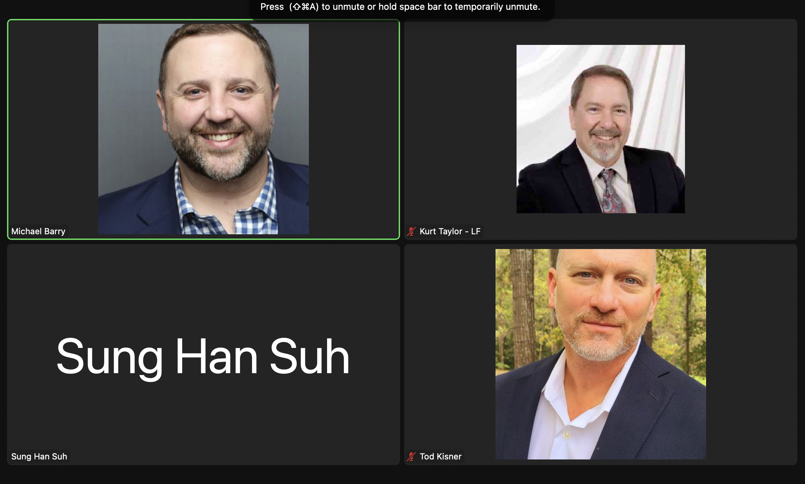

# A Technical Analysis of Confidential Computing
### A Publication of The Confidential Computing Consortium
### November 2022, v1.3

**Changelog Table**

* 1.0 October 23, 2020 First Release.
* 1.1 January 12, 2021 Updated title, link to Outreach white paper, and wording / grammatical corrections.
* 1.2 September 28, 2021 Errata
* 1.3 November 2, 2022 Updated Confidential Computing definition.

**Contents**

* 1 Introduction
* 2 Confidential Computing
  * 2.1 Definition
  * 2.2 Why is Hardware Necessary for Confidential Computing
* 3 Trusted Execution Environments (TEEs)
  * 3.1 Properties
* 4 Related Technologies
  * 4.1 Security Comparisons
  * 4.2 Scalability Comparisons
* 5 Threat Model
  * 5.1 Goal
  * 5.2 Threat Vectors
    * 5.2.1 In-Scope
    * 5.2.2 Out-of-Scope
  * 5.3 Side-Channels
    * 5.3.1 Background
    * 5.3.2 Example
    * 5.3.3 Mitigation
* 6 Attestation
  * 6.1 Hardware-Based Attestation
  * 6.2 Anonymity
  * 6.3 TCB Recovery
* 7 Conclusion
* About the Confidential Computing Consortium
* References

### 1 Introduction

In classical computing, data exists in three states: in transit, at rest, and in use. Data traversing the network
is “in transit,” data in storage is “at rest,” and data being processed is “in use.” In a world where we are
constantly storing, consuming, and sharing sensitive data - from credit card data to medical records, from
firewall configurations to our geolocation data - protecting sensitive data in all of its states is more critical
than ever. Cryptography is now commonly deployed to provide both data confidentiality (stopping unauthorized
viewing) and data integrity (preventing or detecting unauthorized changes). While techniques to protect data in
transit and at rest are now commonly deployed, the third state - protecting data in use - is the new frontier.

A Confidential Computing Consortium whitepaper[1] provides an overview of how Confidential Computing
addresses this problem, along with use cases and motivation. This paper provides more details for a
technical audience.

### 2 Confidential Computing

**2.1 Definition**

Confidential Computing is the protection of data in use by performing computation in a hardware-based,
attested Trusted Execution Environment. (See Section 3 for the definition of a Trusted Execution
Environment.)

Importantly, the definition is not limited to “cloud” uses, but can be applied anywhere including public cloud
servers, on-premises servers, gateways, IoT devices, Edge deployments, user devices, etc. It is also not
limited to such trusted execution being done by any particular processor, since trusted processing might
also be in various other places such as a GPU or a network interface card. Neither is it limited to solutions
that use encryption, though this is the most common technique employed.

Conversely, confidential computing is not the only technique in the space of protecting data in use. A
comparison with other approaches is covered in section 5.

**2.2 Why is Hardware Necessary for Confidential Computing**

Security is only as strong as the layers below it, since security in any layer of the compute stack could potentially
be circumvented by a breach at an underlying layer. This drives the need for security solutions at the lowest
layers possible, down to the silicon components of the hardware. By providing security though the lowest
layers of hardware, with a minimum of dependencies, it is possible to remove the operating system and device
driver vendors, platform and peripheral vendors, and service providers and their admins, from the list of
required trusted parties, thereby reducing exposure to potential compromise at any point in the system lifecycle.

With the goal of decreasing the reliance on proprietary software for confidential computing environments,
the Confidential Computing Consortium has excluded from its scope TEEs that have only software roots of
trust and focused on hardware-based security guarantees for confidential computing environments.
Another Confidential Computing Consortium (CCC) whitepaper[6] provides more discussion of the uses of
confidential computing and the scope of the CCC.

### 3 Trusted Execution Environments (TEEs)

**3.1 Properties**

A Trusted Execution Environment (TEE) is defined by the CCC, following common industry practice, as an
environment that provides a level of assurance of the following three properties:

* **Data confidentiality**: Unauthorized entities cannot view data while it is in use within the TEE.
* **Data integrity**: Unauthorized entities cannot add, remove, or alter data while it is in use within the TEE.
* **Code integrity**: Unauthorized entities cannot add, remove, or alter code executing in the TEE.

In the context of confidential computing, unauthorized entities could include other applications on
the host, the host operating system and hypervisor, system administrators, service providers, and the
infrastructure owner—or anyone else with physical access to the hardware.

Together, these attributes provide not only an assurance that the data is kept confidential, but also that
the computations performed are actually the correct computations, allowing one to trust the results of the
computation as well.

Depending on the particulars of a specific TEE, it may also provide:

* **Code Confidentiality**: In addition to protecting data, some TEEs may protect code while in use from
being viewed by unauthorized entities. For example, this can protect an algorithm that is considered to
be sensitive intellectual property.
* **Authenticated Launch**: Some TEEs may enforce authorization or authentication checks prior to
launching a requested process and may refuse to launch a process that is not authorized or authenticated.
* **Programmability**: Some TEEs may be programmed with arbitrary code, while some may only support
a limited set of operations. A TEE might even include or be composed entirely of code fixed at the time
of manufacture.
* **Attestability**: Often, a TEE can provide evidence or measurements of its origin and current state,
so that the evidence can be verified by another party and—programmatically or manually—it can
decide whether to trust code running in the TEE. It is typically important that such evidence is signed
by hardware that can be vouched for by a manufacturer, so that the party checking the evidence
has strong assurances that it was not generated by malware or other unauthorized parties. (Further
discussion on attestation is provided later in section 7.)
* **Recoverability**: Some TEEs may provide a mechanism for recovery from a non-compliant or potentially
compromised state. For example, if it is determined that a firmware or software component no longer
meets compliance requirements and the launch authentication mechanism fails, it may be possible
to update that component and retry (recover) the launch. Recoverability generally requires that
some component(s) of the TEE remain trusted, which can act as a “root” when other components are
updated. (Further discussion on such recovery is provided later in section 7.)

A hardware-based TEE uses hardware-backed techniques to provide increased security guarantees for
the execution of code and protection of data within that environment. This assurance is often missing in
approaches that do not use a hardware-based TEE.

For more discussion of TEE definitions used in the industry, see the discussion at [6].

### 4 Related Technologies

The TAC conducted a survey of various terms in the industry related to protecting data in use, and
composed the following Venn diagram of technologies:

Figure 1 - Venn diagram of various technologies used to protect data in use

Unfortunately, unlike the term “confidential computing”, several of the terms used in the diagram have
multiple competing definitions. For example, “privacy-preserving computation” is variously defined
as being synonymous with multi-party computation, or covering both multi-party computation and
homomorphic encryption, or even (e.g., in [2]) covering the entire space of protecting data in use.

This diagram illustrates why we refer to confidential computing as protecting data in use by using a
hardware-based TEE, to distinguish it from other techniques.

**4.1 Security Comparisons**

The following table compares a typical TEE implementation with typical implementations of two other
emerging classes of solution that protect data in use, Homomorphic Encryption (HE) and Trusted Platform
Modules (TPM).

|                      | HW TEE                |  Homomorphic Encryption       | TPM           |
| -------------------- | --------------------- | ----------------------------- | ------------- |
| Data integrity       | Y                     | Y (subject to code integrity) | Keys only     |
| Data confidentiality | Y                     | Y                             | Keys only     |
| Code integrity       | Y                     | No                            | Y             |
| Code confidentiality | Y (may require work)  | No                            | Y             |
| Authenticated Launch | Varies                | No                            | No            |
| Programmability      | Y                     | Partial (“circuits”)          | No            |
| Attestability        | Y                     | No                            | Y             |
| Recoverability       | Y                     | No                            | Y             |

Table 1 - comparison of security properties of Confidential Computing vs. HE and TPMs

In practice, the extent to which the properties are present can vary by vendor, model, and algorithm and so
the values of cells above are typical examples, but the first three properties highlight the key differences
in security properties. For example, a typical TPM protects keys, and signs or encrypts data with those
keys, but by itself cannot guarantee that the data presented to it is correct. A TPM is not programmable
with arbitrary code, whereas a TEE is programmable and protects that code and its data. A typical
homomorphic encryption algorithm can protect arbitrary data, but by itself cannot ensure that the correct
operations have been done and that the code has not been tampered with, whereas a TEE again protects
both the data and the code. These techniques are often complementary and can even be used together in
solutions for stronger security.

**4.2 Scalability Comparisons**

The following table shows how scalability in various metrics compares between classical computing,
computing using a typical hardware-based TEE, and Homomorphic Encryption. As with the security
comparison, the actual answers may vary by vendor, model, or algorithm.

|                                           | Native                |  HW Tee             | Homomorphic Encryption    |
| ----------------------------------------- | --------------------- | ------------------- | ------------------------- |
| Data size limits                          | High                  | Medium              | Low                       |
| Computation Speed                         | High                  | High-Medium         | Low                       | 
| Scale out across machines                 | Yes                   | More work           | Yes                       |
| Ability to combine data across sets (MPC) | Yes                   | Yes                 | Very limited              |

Table 2 - comparison of scalability properties of Confidential Computing vs. HE and TPMs

While combining techniques can increase security, such combinations generally lower performance and scalability.

### 5 Threat Model

**5.1 Goal**

Confidential Computing aims to reduce the ability for the owner/operator/pwner of a platform to access
data and code inside TEEs sufficiently such that this path is not an economically or logically viable attack
during execution. Use of the phrase “economically or logically viable” makes assumptions, of course, about
the types of attackers considered: there are some attackers where such considerations may be weighted
differently from others, including nation state actors and some academic institutions. There is an associated
recognition that there is no “absolute security”, but TEEs can raise the bar significantly over other
techniques available for protecting data in use, by various measures beyond confidentiality and integrity
protection, including usability and cost. This improvement allows designers, implementers and operators
of systems managing sensitive data and algorithms to concentrate on other aspects of the system.

The focus on data protection during execution is important, as Confidential Computing is concerned with
data in use. There may be attacks associated with storage and transport (data at rest and data in transit,
respectively) which, though relevant to any systems making use of TEEs, are not directly associated with the
protections that TEEs provide. Some of these may be in scope of Confidential Computing, including:

* Attestation of TEEs and TEE environments to ensure valid and correct deployment;
* Transport of workloads and data to TEE environments;
* Storage of data associated with TEE environments outside the TEE instance;
* Migration of workloads between TEE environments.

In some cases, those deploying workloads into TEE environments may have varying levels of trust in
the owner of the system hosting the workload, and this trust may change over time. Such changes may
be based on factors such as the relationship with the owner or operator of the host, the software and
hardware it comprises, and the likelihood of physical, software, or social engineering compromise. This is
appropriate, and Confidential Computing frameworks and projects may embrace differing trust models
with relation to the host, its owner, its operator, and any other actors.

There are many ways for actors in the ecosystem who rely on the security guarantees of a TEE to establish
trust in the TEE. One approach is to obtain assurance of security statements about products through
assessment by third-party evaluation laboratories. Other approaches include basing assurances on
security statements from specific vendors; community or other audit of open source components in
hardware, firmware, and/or software; and assessment or certification by industry or standards bodies.

**5.2 Threat Vectors**

There are various vectors by which attacks may exploit vulnerabilities in a system: Confidential Computing,
as noted above, does not attempt to address all of them. It is worth providing a description, if not a formal
definition, of various threat vectors that are considered in-scope and out-of-scope for Confidential Computing.

It should be noted that while some types of in-scope threat vectors can generally be expected to be
mitigated by Confidential Computing techniques, there is a set of threat vectors for which the extent of
mitigations will vary significantly based on the silicon implementation, and there may be some “grey areas”
that may be considered in-scope by some vendors, and out-of-scope by others. This is particularly true in
areas such as integrity, rollback, and replay attacks.

**5.2.1 In-Scope**

The following threat vectors are considered to be in-scope for Confidential Computing:

* **Software attacks**: these include attacks on the software and firmware installed on the host, including the
operating system, hypervisor, BIOS, other software and stacks, and workloads associated with any party.
* **Protocol attacks**: these include attacks on protocols associated with attestation as well as workload
and data transport. Any attack that could compromise the attestation of a TEE instance could lead to a
workload or data being compromised in turn. Equally, even if the attestation protocol is not compromised,
a vulnerability in the provisioning or placement of the workload and/or data could cause a
compromise.
* **Cryptographic attacks**: cryptography is an evolving discipline, with vulnerabilities being found over
time in ciphers and algorithms due to a number of factors, including mathematical breakthroughs,
availability of computing power and new computing approaches such as quantum computing. Where
possible, the principle of crypto-agility should be espoused, allowing deprecated cryptographic
primitives to be replaced with newer versions, or approaches better suited to a particular environment.
While this is possible in software and firmware components of TEEs, it is generally impractical in
hardware. In some cases, defense-in-depth may be appropriate, for instance employing quantum-resistant 
cryptography within TEE instances whose implementation is not, itself, quantum-resistant,
but careful consideration needs to be made by qualified persons before assuming that this will provide
protection appropriate to any particular use case.
* **Basic physical attacks**: while long-term intrusive attacks on the CPU are considered out-of-scope
(see below), other attacks are considered in-scope, including cold DRAM extraction, bus and cache
monitoring and plugging of attack devices into an existing port, e.g., PCIe, Firewire, USB-C.
* **Basic upstream supply-chain attacks**: though attacks performed in the supply-chain on TEE
components are out-of-scope (see below), attacks that would compromise them through “gross”
changes such as adding debugging ports are considered to be in scope.

The Confidential Computing Consortium also believes that there exist opportunities to provide guidance to
those designing, implementing and operating workloads around which types of applications which may be
more vulnerable to attacks than others, and also issues around lifecycle management to help mitigate attacks.

**5.2.2 Out-of-Scope**

Threat vectors which are generally considered to be out-of-scope for Confidential Computing include:

* **Sophisticated physical attacks**: these are physical attacks that typically require long-term and/or
invasive access to hardware, including chip scraping techniques and electron microscope probes.
* **Upstream hardware supply-chain attacks**: these exclude attacks on components of a host system
that is not directly providing TEE capabilities, but do include attacks on, for instance, a CPU. Examples
include attacks at chip manufacturing time and attacks at key injection/generation time.
* **Availability attacks (such as DoS or DDoS) attacks**: not addressed by current hardware-based TEEs
as part of their threat model. Software projects and service providers may provide mitigations to such
attacks. (Further discussion of the threat model is provided in section 5.)

### 5.3 Side-Channels

**5.3.1 Background**

TEEs provide a level of assurance for data confidentiality as per the threat model goal described in
section 5.1. However, this assurance rests on some assumptions, a key one being that there are no
exploitable side-channels the owner (or any other entities with access to the system) could use to infer
information about the data or execution. Over the last few years, academic researchers have identified
and demonstrated vulnerabilities in the design of certain TEEs that allow for side-channel attacks that were
hitherto considered only theoretical. These mirror similar discoveries in other technologies such as TPMs
and HSMs, as well as in other isolation or data protection mechanisms. These attacks have caused a lot of
concern across the technology and security community.

**5.3.2 Example**

Here we give a simplified example from elliptic curve cryptography (ECC). ECC uses elliptic curve point
multiplication to produce a one-way function. In ECC, multiplying a point P on a curve by *n* results in a new
point on the curve, *Q*. ECC relies on the fact that it is intractable to determine *n* given both *P* and *Q*. A TEE
might implement this multiplication using a ‘double-and-add’ method to calculate *Q*. In simplified terms,
the method iterates through the binary representation of *n* one bit at a time and performs a *doubling*
operation for each *0* bit and a *doubling* and *addition* operation for each *1* bit.

Since the method is executed inside a TEE, data confidentiality is assured, meaning an attacker is not able
to directly observe the data as it is being derived. However, an attacker may be able to use side-channels
to determine the value of *n*.

One side channel an attacker could potentially exploit if they have physical access to the machine is to
accurately measure the power usage of the TEE CPU during method execution. For example, if the TEE CPU
has a different power usage for addition compared with doubling, the attacker might be able to derive *n*
from the power profile. Not all side channel attacks require physical access, some can be achieved from
software by measuring the time taken to perform contrived operations.

Figure 2 – Example of an attack using power values to infer information about data inside a TEE

A combination of a doubling followed by an addition indicates a 1 for that bit. A doubling that is not
followed by an addition represents a 0. Using this information an attacker can perform a full recovery of *n*.

Notice also that each bit with a value of 1 takes longer to process than a bit with a value of 0. A different
side-channel attack could be performed where the attacker can determine the ratio of 0’s to 1’s in n by
accurately measuring the time it takes for the method to execute, significantly reducing the complexity of
recovering n using a subsequent brute force attack.

Side-channels can allow attackers to infer information about data or operations inside a TEE by exploiting
knowledge of the architecture of the TEE itself. The above example is relatively trivial but sophisticated attacks
can be launched against TEEs using a combination of techniques that have been identified against existing TEEs.

**5.3.3 Mitigation**

A natural assumption is that TEEs themselves should provide the primary defense against side-channel
attacks. However, preventing side channel attacks is collectively the responsibility of the TEE vendors,
third-party vendors, and application developers.

Referring back to the example above, the power and timing side-channel attacks can both be exploited
due to the fact that the method processes 0 bits differently from 1 bits. What if the author of the method
inserted a dummy addition operation for each 0 bit that is encountered? This would result in 0s and 1s
having exactly the same power profile and taking the same time to execute. The attacker would have no
useful side-channel information to exploit.

Not all side-channel attacks and mitigations are as simple as the example above. Some side-channels are
exposed as a result of algorithms in the application developer’s code or third-party libraries. Other sidechannels 
could be exposed due to the implementation of, for example, caching in the CPU hosting the TEE.

Writing code that will be run in a TEE requires a certain level of expertise and understanding of sidechannel 
mitigation techniques, whether that is provided by the application, compiler, SDK, or run-time
environment. TEE manufacturers and third-party vendors supply tools and SDKs targeted specifically at
secure TEE code generation. These can greatly reduce the risk of code authors introducing side-channels
that can be exploited as well as providing a good level of defense against known vulnerabilities in the TEE.

### 6 Attestation

Attestation is the process by which one party, called a “Verifier”, assesses the trustworthiness of a potentially
untrusted peer, i.e., the “Attester”. (These terms are used consistent with the Internet Engineering Task
Force’s “Remote Attestation Procedures Architecture”[4].) The goal of attestation is to allow the Verifier
to gain confidence in the trustworthiness of the Attester by obtaining an authentic, accurate, and timely
report about the software and data state of the Attester.

**6.1 Hardware-Based Attestation**

Hardware-based attestation schemes rely on a trusted hardware component and associated firmware to execute
attestation routines in a secure environment. As an example, an attestation protocol might work as follows:

1. A secure communication channel is established between the Verifier and the Attester;
2. After the secure connection is established, the Verifier generates a challenge and sends it to the Attester;
3. Upon receiving the challenge from the Verifier, the Attester kicks off the attestation process by sending
the challenge to its trusted hardware component and requesting evidence of its software and data state;
4. The trusted hardware component gathers the evidence on the attesting platform and signs the
attestation data and challenge;
5. The Attester returns the signed evidence to the Verifier;
6. The Verifier verifies the signature and appraises the evidence by applying some appraisal policy, such
as comparing the attested platform state against a set of reference values that are deemed to be
trustworthy, and verifying that the signed evidence includes the supplied challenge so that the Verifier
knows the evidence was freshly generated.

The above attestation process establishes the trustworthiness of the Attester and ensures that it was in an
trusted state at the time that the evidence was generated. For a longer discussion including other variations, see [4].

Attestation protocol designs and implementations must also provide assurances around specific security
properties, including:

* **Unforgeability**: Adversaries cannot produce a signature on a message that links to a trusted hardware
component’s signature provided that the trusted hardware component never signed this message.
* **Revocation**: If a trusted hardware component is compromised, signatures from compromised keys are
no longer accepted.

Some attestation schemes also provide:
* **Anonymity**: Adversaries cannot reveal the identity of the trusted hardware component from signatures.

**6.2 Anonymity**

In hardware-based attestation schemes, trusted hardware components can be uniquely identified by
their cryptographic keys, which might allow an adversary to monitor the activity of a particular trusted
hardware component.

One approach to addressing this requirement is adopted by Direct Anonymous Attestation (DAA) schemes
(e.g., algorithms specified in ISO/IEC 11889:2015[5]), which attempt to tackle this privacy challenge by
leveraging advanced cryptographic primitives such as zero-knowledge proofs and group signatures. In
practice, the DAA schemes can be realized using a variety of cryptographic techniques, including RSA,
Elliptic Curve Cryptography (ECC), Pairing-based Cryptography (PBC), or Lattice-based Cryptography (LBC).

**6.3 TCB Recovery**

Trusted Computing Base (TCB) Recovery is the process of being able to re-establish the trustworthiness of
a TEE should at some point a flaw in the TCB of the TEE be discovered that can be repaired. For example,
the attestation process will result in a Verifier concluding that an Attester is not fully trustworthy if the signed
evidence does not match the latest expected values for a secure system, resulting in the need for such repair.

The TCB of the TEE, typically including both immutable and mutable portions, provides the functionality of
creating the evidence used in the attestation process. If a flaw is found in the TCB, then this process itself
could be spoofed or subverted. TEE implementations may include special techniques to allow the mutable
portions of the TCB to be updated, secured by the immutable portion. Any new attestation evidence
created after the update then identifies and demonstrates that the update has taken place, in a manner
that could not be spoofed by the previously flawed implementation.

### 7 Conclusion

Confidential Computing, through the use of hardware-based, attested Trusted Execution Environments ,
protects sensitive data and code against an increasingly common class of threats occurring during data
execution that were previously difficult, if not impossible, to protect against. For example, in classic security
threat models, the owner or operator of a system is typically considered trusted, whereas Confidential
Computing also allows for the protection of data against adversarial owners.

Together with hardware-based attestation techniques, Confidential Computing can provide a strong level
of assurance of data integrity, data confidentiality, and code integrity. Even when other techniques such as
TPMs or Homomorphic Encryption are used, adding Confidential Computing and hardware-based
attestation can improve security by providing a level of assurance of data and code integrity. With these
increased protections for data-in-use, new use cases become more realistic, e.g. multi-party computations
in financial and/or regulated industries or machine learning at the edge, where the data being operated
needs protecting from the processing environment owner itself.

### About the Confidential Computing Consortium

The Confidential Computing Consortium (CCC) is a community focused on projects securing data in
use using hardware-based TEEs and accelerating the adoption of confidential computing through open
collaboration. The CCC brings together hardware vendors, cloud providers, and software developers to
accelerate the adoption of Trusted Execution Environment (TEE) technologies and standards.

It is not the intent of this whitepaper, or the CCC, to evaluate or compare specific vendor technologies. This
whitepaper aims to set context and define consistent terminology that vendors can use to describe their
products, allowing others to make a like-to-like comparison between the various offerings in this space.

This content represents the collaborative work (“Work”) of the Confidential Computing Consortium (“CCC”).
The CCC is solely responsible for the Work and Individual CCC members may not have contributed or
participated or may not endorse it.

### References
[1] Confidential Computing Consortium, “Confidential Computing: Hardware-Based Trusted Execution for Applications and Data”,
November 2022. https://confidentialcomputing.io/ccc_outreach_whitepaper_updated_november_2022/

[2] United Nations Global Working Group, “UN Handbook on Privacy-Preserving Computation Techniques”, March 2019. 
https://docs.google.com/document/d/1GYu6UJI81jR8LgooXVDsYk1s6FlM-SbOvo3oLHglFhY/edit

[3] GlobalPlatform, “TEE System Architecture v1.2”, December 2018. https://globalplatform.org/specs-library/tee-systemarchitecture-v1-2/

[4] Internet Engineering Task Force (IETF), “Remote Attestation Procedures Architecture,” Work in Progress, July 2020.
https://tools.ietf.org/html/draft-ietf-rats-architecture

[5] International Organization for Standardization, “Information technology — Trusted platform module library — Part 1:
Architecture”, ISO/IEC 11889-1:2015, August 2015. https://www.iso.org/standard/66510.html

[6] Confidential Computing Consortium, “Confidential Computing Consortium Scope”, October 2020.
https://github.com/confidential-computing/governance/blob/master/scoping.md
