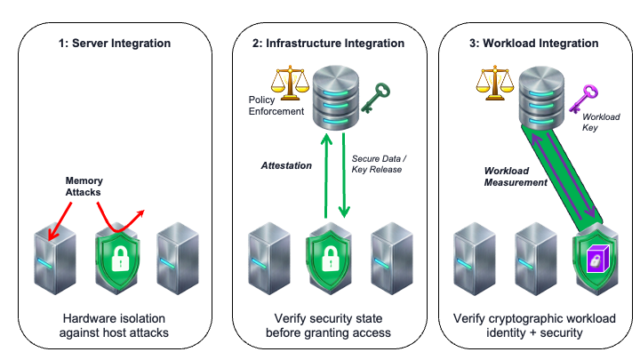
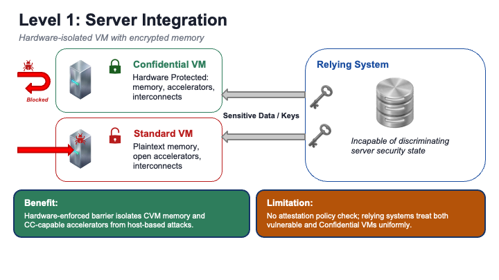
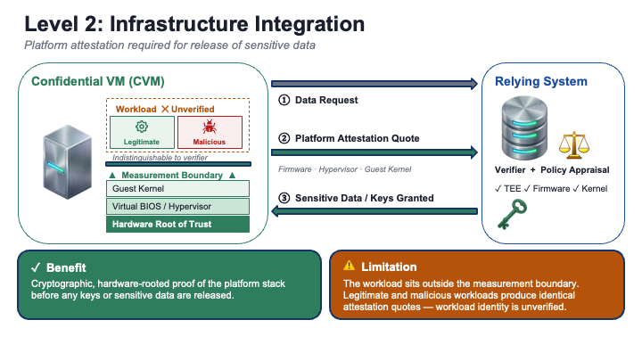
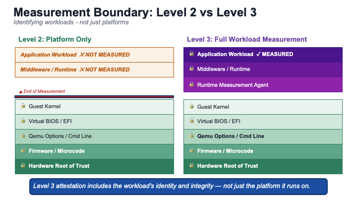

# 3 Degrees of Confidential Computing
### A Publication of The Confidential Computing Consortium
### May 2026, v1
### Lead editor: Dan Middleton
### NVIDIA Principal Software Architect
### CCC Technical Advisory Council, Chair

**Changelog**

* v1 May 2026 First Release.

## Executive Summary

Confidential Computing (CC) has transitioned from a niche security technology to a strategic imperative for protecting data in use. However, CC is not a singular, monolithic security control. It provides hardware backed capabilities that can be adopted on a server, across the network, and integrated into workloads. Ultimately, the security benefits of Confidential Computing increase with the level of integration. This paper defines a three-level maturity model for Confidential Computing adoption. By delineating these levels, practitioners can better assess their current security posture, communicate requirements to vendors, and roadmap their journey toward fully attested and cryptographically verified workloads.

The progression begins with workload servers by isolating standard workloads with hardware-backed security for immediate protection against attacks initiated from the host. Organizations can then enforce this protection by integrating security policy decisions into the rest of the infrastructure. Systems controlling access to secrets like keys leverage remote attestations to actively verify Confidential Computing server security before granting access to sensitive data or keys. Reaching a complete baseline adoption involves deepening the integration to enforce workload-specific protections tied directly to cryptographically verified application identities. This establishes a robust foundation for advanced integrations, such as specialized multi-server interactions, which fall outside the scope of this paper. The following sections outline each of these three levels, reviewing the architecture, security posture, and limitations, while providing open source examples to guide your adoption strategy.

## Preliminaries

Confidential Computing is the protection of data in use by performing computation in a hardware-based, attested Trusted Execution Environment (TEE). The TEEs are most commonly embodied as Confidential Virtual Machines (CVMs). CVMs provide confidentiality and integrity protections to workloads. The primary security mechanisms are integrated hardware memory controls which often include encryption. CC is focused on threats external to the workload and doesn’t protect against vulnerabilities introduced within the TEE boundary including the guest OS, utilities, and workload. Another key feature of CC is Remote Attestation, which enables remotely assessing the security properties of the software and hardware environment before trusting it. Among its limitations, CC does not protect against all physical attacks and depends on a shared security model with datacenter physical security. For a more complete introduction to CC see the CCC whitepapers.

## Level 1: Server Integration (Lift and Shift)

*"Hardware-backed protection with minimal operational change."*

Level 1 represents the entry point for most organizations. The focus is migrating workloads from standard VMs to Confidential VMs (CVMs) to instantly upgrade their security posture. This transition establishes a hardware security barrier against privileged actors and other tenants on shared infrastructure, without the need to modify code. However, without integrating remote attestation, it does not meet the definition of Confidential Computing.

* The Architecture:
  * Workload: No change to the application or other systems that interact with it.
  * Infrastructure: Select CVM-capable instance families (utilizing AMD SEV-SNP, Intel TDX, or Arm CCA) often with newer OS kernels supporting CC features.
  * Accelerators: Workloads that require accelerators like LLM serving must update to select CC-compatible devices, e.g. NVIDIA Hopper and later GPUs.
* Security Posture:
  * Threat Model: Protects against memory attacks by privileged host software including the hypervisor and privileged actors like sys admins. It provides strong tenant isolation in multi-tenant environments.
  * Attestation Role: Absent
  * Limitations: Without integrating attestations, the deployment model lacks a policy decision point. While the infrastructure provides protections, relying systems aren’t verifying them. Consequently, the workloads remain vulnerable to downgrade attacks or configuration drift, as there is no mechanism to withhold sensitive data from non-compliant or compromised infrastructure.
* Examples: Beyond CSP provided instance types, and commercial virtualization products, open source support for CVMs is increasingly available in OpenStack, OpenNebula and KubeVirt.

## Level 2: Infrastructure Integration (Enforcement)

*"Data access is granted based on assessed security policy."*

Level 2 moves beyond passive protection to active enforcement. In Level 1 we turned on CC in workload servers. In Level 2 we enable other systems in the datacenter to interrogate workload servers for their CC status. At this stage, the infrastructure is aware of the CVM's security state. The critical shift is the integration of attestation into systems that supply workloads with sensitive data or keys. These act as a "Policy Decision Point" to enforce Confidential Computing.

* The Architecture:
  * Workload: Confidential VMs utilize a sidecar or agent to attest to sensitive data repos or key management servers.
  * Infrastructure: A verifier (typically implemented as an attestation verification service and often implemented as an independent system), acts as an authorization provider. It evaluates the attestation evidence against a security policy to assess the CVM security state before granting access to a resource like regulated data or keys.
  * Key Handling: Provisioned to protected memory without ever writing to disk.
* Security Posture:
  * Threat Model: Creates an elevated tier of security assurance within an enterprise. Mitigates risks from unpatched/vulnerable hardware and human error in deployment. Attested measurements also support attribution and auditability.
  * Attestation Role: Active Enforcement.
  * Limitations: While data is only decryptable by a measured CVM, the applications within the CVM are not measured. The trust is anchored to the VM image and the hardware, not to its executables. Many CVMs may provide the same measurements. For example, a datacenter may have a number of kubernetes worker nodes which are identical before pods are scheduled. Conventional VMs also include interactive logins like SSH which creates a large vector for unmeasured changes to the runstate of the CVM.
* Examples: Most major Cloud Service Providers (CSPs) have integrated attestation into their first-party services. Enterprises can make use of attestation services offered by hardware vendors and open source implementations such as the CCC’s Veraison and CNCF’s Trustee.

## Level 3: Workload Integration (Application Identity)

*"Code is Identity. No Shells. Zero Trust."*

Level 3 represents full adoption of Confidential Computing features. The chain of trust extends into the VM, directly to the application runtime. This level requires purpose-built CVMs, but offers the strongest security guarantees possible today.

* The Architecture:
  * Workload: The CVM includes a utility to measure the workload. The design of the CVM restricts execution to only the required confidential computing utilities and the workload itself. Services like SSH and interactive shells are disabled such that, once the workload is loaded, the CVM is essentially immutable. Other guest-side primitives such as storage must be hardened as well.
  * Infrastructure: Attestation policies become more stringent and typically require runtime measurements. These are used to assess the chain of trust into the VM through supporting utilities to the workload.
* Security Posture:
  * Threat Model: Prevents undetected modification of runtimes and significantly reduced threat surface, even from organizations’ own insiders (e.g, Site Reliability Engineers, DevOps, or other system administrators).
  * Attestation Role: Granular Identity. Policies restrict interactions to cryptographic hashes of application code, i.e., the workload that is requesting a secret is the exact workload that is trusted to receive it.
  * The "Clean Room": This level enables scenarios where competitors can pool data for joint analysis (e.g., fraud detection, ML training) with cryptographic assurances that no data can be exfiltrated.
  * Limitations: In order to minimize risks of leakage, logging and telemetry are restricted at this level which may complicate availability. Also, measurements primarily apply to the launch state. A successful exploit after launch will not be detectable by attestation. However, once a vulnerable version is known, attestation measurements can identify and automatically block those versions in deployment.
* Examples: CNCF Confidential Containers (CoCo) extends Kubernetes to launch pods in lightweight CVMs (microVMs). The container image and configuration are measured before the workload starts. Containers can even be encrypted to provide workload confidentiality for valuable IP such as proprietary AI models.

## Conclusion: The Journey Up the Stack

While Level 1 provides immediate isolation benefits, without attestation it does not condition access to resources based on security and does not meet the definition of Confidential Computing. Level 2 introduces the critical integration of attestation-based access control, effectively automating security decisions based on infrastructure-level security.

However, organizations should view Level 3 as baseline adoption. Level 3 realizes the benefits of Confidential Computing: automated decisions based on workload identity, integrity, and the security state of its infrastructure. By strictly limiting execution to necessary utilities and the workload itself, Level 3 renders the environment essentially immutable and highly resistant to attacks. Furthermore, it allows containers to be encrypted to provide workload confidentiality for highly valuable IP, such as proprietary AI models. Organizations may go further and adopt patterns like multi-CVM interactions, specialized enclaves for key brokering, AI agent sandboxes, CC-aware network protocols, CC-enforced software provenance with transparency logs, and many other concepts outside the scope of this introduction to enterprise adoption of Confidential Computing.

**How to Journey Up the Stack:**

* Turn on Hardware Security (Level 1): Begin by migrating standard VMs to CVMs to secure a hardware-enforced barrier against privileged host actors, instantly upgrading your security posture with minimal operational changes.
* Integrate Enforcement (Level 2): Shift from passive protection to active enforcement by integrating attestation into your relying systems. Gain experience with attestation policies and operationalizing automated authorization.
* Lock Down the Workload (Level 3): For your most critical assets, utilize purpose-built CVMs that protect the application runtime, and facilitate stringent attestation policies, so that only the exact, cryptographically verified workload can access its corresponding secrets. Open source projects like CNCF Confidential Containers exist to meet this need often through downstream commercially supported products; as well as proprietary products available through Confidential Computing Consortium member companies.

To learn more about implementing these stages and to collaborate with industry experts, visit the [Confidential Computing Consortium website](https://confidentialcomputing.io/) and learn at any of the community meetings, maillist, and Slack discussions.

For further reading, refer to the CCC’s [Technical Analysis](../analysis/technical-analysis.md) and other whitepapers.
