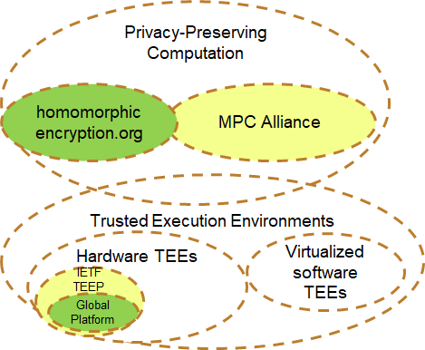

# TAC Scoping Discussion

## 1. Introduction

This document discusses two related, but different, questions:

1. Should the term "confidential computing" be narrowly scoped to TEEs
   (or even only certain classes of TEE) or more broadly defined?
   [Section 2](#markdown-header-2-fine-grained-questions) breaks this
   question down further.

2. Should the consortium's scope be narrowly scoped to TEE-based projects,
   or be more inclusive?

The board needs to answer each of the above questions, keeping in mind that:

* If a narrow answer is chosen, the focus stays on TEEs, and messaging 
  on terminology might compete with other bodies in the industry.

* If a broad answer is chosen, more discussion happens inside the CCC and the
  CCC has the opportunity to have more unified messaging across the industry.

## 2. Related Terminology

The TAC conducted a survey of various related terms in the industry and
composed the following Venn diagram:

Definitions of the various terms in the diagrams can be found in
[Appendix A](#markdown-header-appendix-a-related-terminology).

The solid blue lines indicate that the area is clearly already in scope
for CCC discussion and projects. The dotted blue lines indicate uncertainty
as to whether they would (or should) fall into any intended definition
of "confidential computing" and/or scope of the CCC.

For example, the term "privacy-preserving computation" is confusingly
similar to "confidential computing", so that a novice reader can easily
think these terms are synonymous. It is up to the board's scoping decisions
to determine the extent to which they are synonymous, related, or disjoint,
based on the TAC's technical information provided in this document,
along with any other relevant considerations.

There are other relevant standards bodies operating in the overall space,
as depicted in the following diagram:

Based on the CCC scoping, various relationships (e.g., liaisons) might
be appropriate.  (None of the others are legal entities hosting open
source projects, but all of them publish specifications.)

## 2. Fine-Grained Questions

The TAC concluded that each scoping question can be broken down further
into five roughly orthogonal axes, each with a spectrum of narrow-to-broad
options:

1. Hardware/software only or also algorithmic (mathematical)? The TAC so 
   far has no consensus view on this question, as opinions were split.

2. Hardware-based (+firmware?) required or also software-only? The TAC 
   certainly agrees that hardware-backed solutions are already in scope,
   but does not yet have consensus on whether software-only should be
   included or not.

3. Generalized (fully programmable) only, or also configurable
   (semi-programmable) and even specialized (fixed-purpose, non-programmable)
   also?  So far, no one on the TAC has argued for non-programmable, but
   the TAC did not ask the question of whether it would want to reject a
   submission in that category.

4. On-main CPU only, or also separate processors also?  The TAC has consensus
   to recommend that the board include the entire spectrum here.

5. Cloud only, or also on-premises (including IoT) also?  The TAC has consensus
   to recommend that the board include the entire spectrum here.

All five of these are strategy questions for the board to answer, not
technical questions for the TAC per se, although based on the answers
chosen, the TAC will have technical feedback on any resulting wording.

The TAC also discussed that other attributes (e.g., TCB size) are also
important security evaluation criteria for any given solution or project,
but by themselves weren't seen as part of a scoping question per se.

The following table shows how various example technologies fall into the 
above axes, to help illustrate how answers would affect what sorts of 
projects might be accepted or rejected as a result:

## 3. Confidential Computing Definitions

There are various competing definitions of "confidential computing"
including (possibly among others):

* **Gartner report**: Confidential computing is the combination of 
  CPU-based hardware technology and infrastructure as a service (IaaS)
  **cloud** provider virtual machine (VM) images and software tools that 
  enable cloud-using organizations to create completely isolated
  **trusted execution environments (TEE), also called enclaves**. Because
  they offer a form of **encryption** of data in use, these enclaves
  render sensitive information invisible to host OSs and cloud providers.

The TAC observed the following issues with the above definition:

1. It is constrained to only cloud, whereas the TAC consensus is that
   a broader scope is needed, even for projects already in the CCC.

2. The term "encryption" is problematic since some TEEs of interest
   may have other forms of protecting data in use, encryption is just
   one example mechanism.

Furthermore, the text about TEEs implies a narrow answer to axis 1,
which may or may not be desirable.

* **[CCC press release](https://www.linuxfoundation.org/uncategorized/2019/10/confidential-computing-consortium-establishes-formation-with-founding-members-and-open-governance-structure/)**: Established in 2019, the Confidential
  Computing Consortium brings together hardware vendors, cloud providers,
  developers, open source experts and academics to accelerate the
  confidential computing market; influence technical and regulatory
  standards; build open source tools that provide the right environment
  for **TEE** development' and host industry outreach and education
  initiatives. Its aims to address **computational trust and security
  for data in use, enabling encrypted data to be processed in memory
  without exposing it to the rest of the system**, reducing exposure
  to sensitive data and providing greater control and transparency for users.

The use of "encrypted" is again seen as problematic.  In addition,
the text is at best ambiguous about the scope, as the text about
tools is constrained to "TEE" development, but the aims are broader,
applying to protecting "data in use", where all of Figure 1 would
claim to be about protecting data in use.

* **[Mark Russinovich blog](https://azure.microsoft.com/en-us/blog/introducing-azure-confidential-computing/)**: Put simply, confidential computing 
  offers a protection that to date has been missing from public clouds, 
  **encryption of data while in use**. ...
  Confidential computing ensures that when data is "in the clear," which
  is required for efficient processing, the data is protected inside a
  Trusted Execution Environment (TEE - also known as an enclave), an
  example of which is shown in the figure below. TEEs ensure there is
  no way to view data or the operations inside from the outside, even
  with a debugger. They even ensure that only authorized code is permitted
  to access data. If the code is altered or tampered, the operations
  are denied and the environment disabled. The TEE enforces these
  protections throughout the execution of code within it.

The use of "encrypted" is again seen as problematic.  Also the definition
is similarly ambiguous in that "data while in use" is broad (all of Figure 1)
but then the discussion only mentions TEEs.  (A request to Mark for
clarification resulted in him answering that he did not intend the definition
to be limited to TEEs.)

* **[TechTarget definition](https://searchcloudcomputing.techtarget.com/definition/confidential-computing)**: Confidential computing is a concept in 
  which **encrypted** data can be processed in memory to limit access to
  ensure **data in use is protected**. Confidential computing is a concept
  promoted by the Confidential Computing Consortium, which is a group of
  organizations that wants to build **tools supporting the protection of
  data**. This concept is especially suitable for public clouds. 

The use of "encrypted" is again seen as problematic.  However, the rest of
the definition is clearly broadly scoped to protecting data in use (which
may or may not be desired), and the article goes on to discuss the CCC
after the above definition.

* **John Haxby**: Software solutions to enable the widespread use of hardware
  trusted execution environments.

* **Brandon Baker**: Standards-based solutions to enable the widespread use 
  of trusted execution environments rooted in hardware.

The above two definitions are narrowly scoped to only hardware-based TEEs,
which may or may not be desired.

## Appendix A. Related Terminology

### A.1. Trusted Execution Environment (TEE)

There are many competing definitions of what a "TEE" is, many of which are
listed below:

* **[Wikipedia](https://en.wikipedia.org/wiki/Trusted_execution_environment)**:
  A secure area of a **main** processor. It guarantees code and data loaded
  inside to be protected with respect to confidentiality and integrity. A
  TEE as an isolated execution environment provides security features such
  as isolated execution, integrity of applications executing with the TEE,
  along with confidentiality of their assets.

As noted earlier, the TAC dislikes the above definition because of its
constraint to a "main" processor.

* **[ARM website](https://blog.quarkslab.com/introduction-to-trusted-execution-environment-arms-trustzone.html)**: a secure area inside a **main**
  processor. It runs in **parallel of the operating system**, in an
  isolated environment. It guarantees that the code and data loaded in
  the TEE are protected with respect to confidentiality and integrity. 

Besides the "main" processor issue, another problem the TAC saw with the
above definition is that it assumes there exists a regular operating system
on the same processor.  In some environments (MCUs, FPGAs, etc.), that is
not necessarily the case.

* **GlobalPlatform**: A device that conforms to specifications from GP's
  [TEE Committee](https://globalplatform.org/technical-committees/trusted-execution-environment-tee-committee/).

The above definition excludes various TEEs (including Intel SGX) from its
definition, which the TAC finds problematic.

* **Mike Bursell's strawman**: A hardware-based technique for securing
  sensitive data and algorithms in such a way that even the kernel,
  root user or hypervisor can't see what's going on

The above definition is narrowly scoped to only hardware-based TEEs,
and thus excludes the items in [Section A.1.1](#markdown-header-a-1-1-software-tee) which may or may not be desirable.

One relatively minor issue as worded is that it implies that the TEE has
a kernel, root user, or hypervisor, which may or may not be the case.

* **[IETF TEEP WG](https://tools.ietf.org/html/draft-ietf-teep-architecture)**:
  An environment that enforces that only authorized code can execute with
  that environment, and that any data used by such code cannot be read
  or tampered with by any code outside that environment.

Thie above definition is broader, includes language similar to the broader
text in the Mark Russinovich blog, and has no immediate flaws that the TAC
found.  Some TAC individuals would like to see additional constraints
added to it, but there is not necessarily TAC consensus on such gaps.
(Full disclosure: the TAC chair is also a co-editor of the IETF document
with the above definition.)

#### A.1.1. Software TEE

There are multiple products and solutions today that are software-based and
use the term "TEE", ranging from ones meant for production use, to ones
meant just for development of code to be later used on hardware TEEs.

Some examples include:

* **[Virtual Secure Mode (VSM)](https://azure.microsoft.com/en-us/blog/introducing-azure-confidential-computing/)**: a software-based TEE that's
  implemented by Hyper-V in Windows 10 and Windows Server 2016. Hyper-V 
  prevents administrator code running on the computer or server, as well
  as local administrators and cloud service administrators from viewing
  the contents of the VSM enclave or modifying its execution.

* **[QEMU](https://www.linaro.org/blog/arm-trustzone-qemu/) ("quick emulator")**: very widely used open source machine emulator. ... Developers can use 
  the QEMU Arm Security Extensions to develop and work with Trusted
  Execution Environments (TEEs) that are likely to be the primary consumers
  of the added functionality. Secure applications can then be developed
  on the added TEEs without the need for dedicated hardware.

Other examples exist from other organizations not affiliated with the CCC.

### A.2. Privacy-Preserving Computation

* **[multi-party computation (MPC)](https://en.wikipedia.org/wiki/Multi-party_computation)**, or **privacy-preserving computation**: a subfield of
  cryptography with the goal of creating methods for parties to jointly
  compute a function over their inputs while keeping those inputs private.
  Unlike traditional cryptographic tasks, where cryptography assures
  security and integrity of communication or storage and the adversary
  is outside the system of participants (an eavesdropper on the sender
  and receiver), the cryptography in this model protects participants'
  privacy from each other.

* **[Homomorphic encryption](https://en.wikipedia.org/wiki/Homomorphic_encryption)**: a form of encryption that allows computation on ciphertexts,
  generating an encrypted result which, when decrypted, matches the
  result of the operations as if they had been performed on the plaintext.
  Homomorphic encryption can be used for **privacy-preserving** outsourced
  storage and **computation**. This allows data to be encrypted and
  out-sourced to commercial cloud environments for processing, all while
  encrypted.

Other sources discussing the relationship among these terms, that were
instrumental in constructing Figure 1, include:

* https://baffle.io/blog/homomorphic-and-multiparty-computation/

* https://medium.com/@PlatON_Network/privacy-preserving-computation-secure-multi-party-computation-i-5b09a20053ce

### A.3. Other Terms

* **[secure cryptoprocessor](https://en.wikipedia.org/wiki/Secure_cryptoprocessor)**: a dedicated computer-on-a-chip or microprocessor for carrying out
  cryptographic operations, embedded in a packaging with multiple physical
  security measures, which give it a degree of tamper resistance. Unlike
  cryptographic processors that output decrypted data onto a bus in a
  secure environment, a secure cryptoprocessor does not output decrypted
  data or decrypted program instructions in an environment where security
  cannot always be maintained. The purpose of a secure cryptoprocessor is
  to act as the keystone of a security subsystem, eliminating the need to
  protect the rest of the subsystem with physical security measures.

* **[Trusted Platform Module](https://en.wikipedia.org/wiki/Trusted_Platform_Module)** (**TPM**, also known as ISO/IEC 11889): an international standard
  for a secure cryptoprocessor, a dedicated microcontroller designed to
  secure hardware through integrated cryptographic keys.

* **[hardware security module (HSM)](https://en.wikipedia.org/wiki/Hardware_security_module)**: a physical computing device that safeguards and manages
  digital keys for strong authentication and provides cryptoprocessing.

* **[Secure Element (SE)](https://www.justaskgemalto.com/en/what-is-a-secure-element/)**: a microprocessor chip which can store sensitive data and run
  secure apps such as payment. It acts as a vault, protecting what's inside
  the SE (applications and data) from malware attacks that are typical in
  the host (i.e. the device operating system).

* **[Dedicated Security Component](https://www.commoncriteriaportal.org/communities/docs/cpp_dsc_v10d_DRAFT_20190501.docx)**: the combination of a
  hardware component and its controlling firmware dedicated to providing
  the encompassing platform with services for the provisioning, protection,
  and use of Security Data Objects (SDOs) consisting of keys, identities,
  attributes, and other types of Security Data Elements (SDEs).
