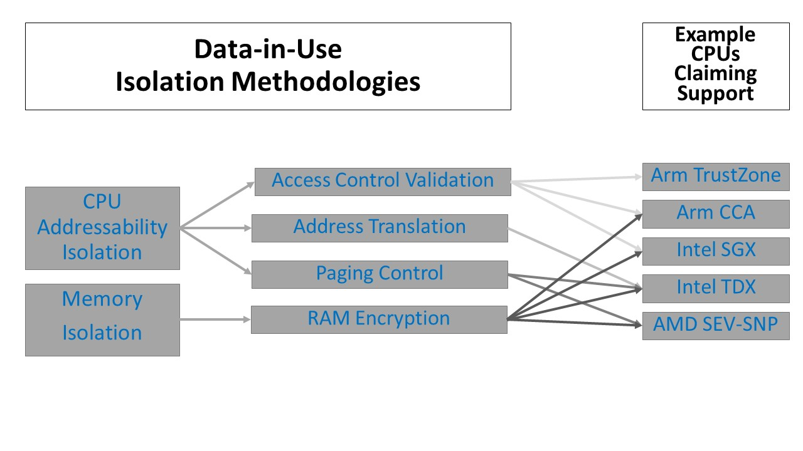
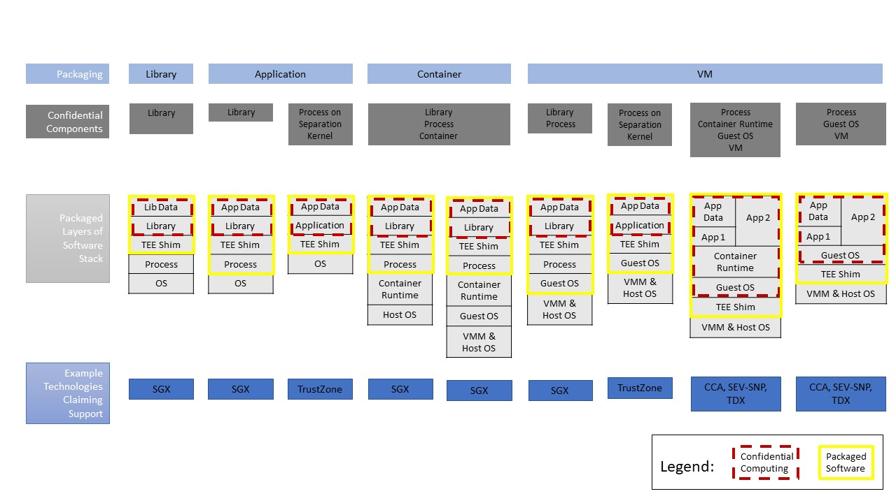

# DRAFT Common Terminology for Confidential Computing

## Introduction

As more companies and open source projects begin to use similar terms to describe similar paradigms 	that build upon hardware-based Trusted Execution Environments (TEEs), it will be increasingly important that vendors use consistent terminology that describes the ways in which these new capabilities are applied within different functional domains. 

The Confidential Computing Consortium has defined [^1] Confidential Computing as “the protection of data in use by performing computation in a hardware-based Trusted Execution Environment”, and identified three primary attributes for what constitutes a Trusted Execution Environment: data integrity, data confidentiality and code integrity. As described in Confidential Computing: Hardware-Based Trusted Execution for Applications and Data, four additional attributes may be present (code confidentiality, programmability, recoverability, and attestability) but are not strictly necessary for a computational environment to be classified as Confidential Computing. 

This paper defines  additional applications of the term confidential as a descriptive prefix, such as “confidential container”, “confidential virtual machine”, etc. Such terms have already begun to appear in marketing materials and commercial products, and in related open source projects. 

This paper focuses on Confidential Computing and the associated “confidential xxx” terms to provide a common vocabulary when describing the impact of adding confidential compute to a computer's architecture.   The goal is to sufficiently describe the different potential architectural changes introduced by isolating compute workloads so that the implications of securing complete applications and their data can be properly evaluated.   Memory isolation is one of the new elements introduced by Confidential Computing.  And being able to protect a running application changes significantly how to approach computer security.   Cyber-attacks often start with a compromise of memory contents (extracting data or modifying memory state to enable execution). Therefore the ability to have effective memory isolation has long been recognized as the best potential mitigation.   But protection of data in use is only one part of an application's security.  An aggregate solution of leveraging Confidential Computing with the at-rest and in-motion protection is required to fully protect sensitive workloads and their data wherever it goes.

In cloud computing, for example, protecting data in use becomes a fundamental requirement to enable clients to control protecting applications and their data while running on the infrastructure provided by the cloud vendor.   All clouds support a shared responsibility model built on a degree of trust.  Confidential Computing permits the separation of responsibilities and isolation of resources in a stronger way.  

## Packaging Model Terminology

This document defines the following terms:

1. confidential library: a library (e.g., an “enclave”) that is executed inside a hardware-based TEE and may be used by an application outside the TEE.

2. confidential process: a process (e.g., a “Trusted Application”) that is executed inside a hardware-based TEE. 

3. confidential container: an Open Container Initiative (OCI)-compliant [^2] container that is executed inside a hardware-based TEE. 

4. confidential VM: a virtual machine that is executed inside a hardware-based TEE, whereby code and data within the entire VM image is protected from the hypervisor and the host operating system.

## Isolation Methodologies

The aforementioned packaging terms will be delivered by software running in concert with a TEE's hardware and firmware.  This combination will deliver a blend of data confidentiality, data integrity, and/or code integrity protections. 
Data confidentiality is delivered in runtime by isolating a specific TEE context within the processor (whether a CPU or other processing unit such as a GPU), and potentially within the RAM.  There are multiple methodologies for delivering data-in-use protection. Three examples of technologies which limit the CPU’s addressability/reachability of TEE data include:

* Access Control Validation: access to areas of memory is limited to certain processes/contexts.

* Address Translation: segmented areas of memory are simply not directly addressable from outside the boundaries of the TEE.

* Paging control: non-TEE processes are not active within the CPU concurrently with TEE data.

Of course the CPU is not the only place where TEE data might be visible. Such data is commonly stored in RAM as well.  And when in RAM, side channel attacks might be attempted on the TEE data. Protecting the RAM from such attacks can be accomplished in ways such as the encryption of the TEE data within the RAM.  
Processor vendors will typically bundle multiple isolation methodologies to protect their implementations. It is upon these bundles that software providing Confidential Computing capabilities is then layered.  

But what layers of software are actually being integrated and delivered upon these isolation methodologies?  The packaging of software layers depends on whether the code is prepared for consumption by software developers, systems integrators, or systems administrators.  It is quite possible that many nested layers of application of packaging will occur before the code is actually installed by a systems administrator.
With this in mind, below in columns are nine examples of how software layers may actually be packaged for consumption by downstream participants of the software supply chain.  In these examples, only the software elements of the Trusted Computing Base (TCB) as defined by NIST 800-12 Rev.1 [^3] are highlighted.  Other elements of the TCB such as the Firmware and Hardware are not shown.

As can be seen in the diagram, each of these nine embodiments can be mapped to one of the four aforementioned packaging terms.  Additionally, each of the nine columns is supportable by some subset of Data-in-Use isolation methodologies. 
Such a categorization of packaging can prove useful to end users of Confidential Computing in that it becomes possible to:

* Express the elements of software which should be expected as part of a packaged offering.

* Understand what information is isolated (or not) within a specific packaged offering.  Note: This is shown by the dotted red line delineating the confidential computation running in the isolated portion of memory.

* Understand common roles across isolation methodologies, such as a “TEE shim” which helps load the TEE, and passes information to and from protected memory.

* Understand how various CCC projects are able to abstract away differences in memory isolation methodologies via common northbound abstractions.

* Understand how packaged APIs exposed from a TEE may be interfaced to other software.  This includes the ability for a TEE to load additional code/data over a secure channel once confidentiality has been established.

* Allow comparisons of packaged software alternatives, each of which may be based on different isolation methodologies.

* Enable extensibility so that emerging processor technologies can assert packaging models they support (e.g., RISC-V based). 

Various CCC projects will deliver code aimed at one or more of the packaging models described here. Examples of this may include:

* Occlum could help a developer insert an existing application within a "Confidential Process" package built upon Intel SGX.

* Enarx could help a developer compile a single application package that can be deployed across multiple deployment categories transparently.  The same could be run both within a “Confidential Process” such as SGX or a “Confidential VM” such as SEV-SNP, with Enarx providing an abstraction layer to ensure the same runtime environment.

* Open Enclave could allow developers to design “Confidential Processes” capable of working on both TrustZone and SGX.

* Gramine could be utilized in the role of the “TEE Shim” across any package on SGX.
 
## Attestation

However a workload is packaged, the resulting deployment should a mechanism to allow validation
of an assertion that it is running in a TEE instance. In Confidential Computing an attestation is
the validation of a hardware signed report (an "attestation report") of the measurements of the TCB.
The measurements provided in the attestation relate to the TCB boundaries
depicted in the diagram above. An attestation for process isolation provides assurances about an 
application, whereas an attestation for VM isolation provides assurances about a VM and/or the virtual
firmware used to launch the VM.

Attestation results may be used to support stateless communication, e.g., this
datagram or computational result was produced by a specific TEE instance; or stateful communication,
e.g., this TLS channel is terminated within a specific TEE instance. The packaging provider may
include an attested protocol such as [RA-TLS](https://arxiv.org/pdf/1801.05863.pdf), or provide
API access to granular attestation APIs in the TEE stack. The protocol or API methods must support
best practices for attestation including freshness, certificate hygiene, and TCB
measurement.

A full description of attestation bestv practices is outside the scope of this document. Interested
readers are encouraged to read the [IETF RATS Working Group]( https://datatracker.ietf.org/group/rats/about/) 
body of work, especially the [RATS Architecture](https://datatracker.ietf.org/doc/draft-ietf-rats-architecture/).
The Confidential Computing Consortium also runs an [Attestation Special Interest
Group](https://github.com/CCC-Attestation) which is open to public participation and provides a
wealth of [recorded and written content](https://github.com/CCC-Attestation/meetings).

## Conclusion/Summary

Confidential Computing is a paradigm that is enabled by a fundamental architectural addition to modern processors that has the potential to be as transformational to the way computers operate as the introduction of virtualization when it was added to commercially available chips.  By creating the ability to protect data in use, it provides an important component to how trust, privacy, and security can be managed in modern systems.  To increase the adoption of this technology, it is important to have a common vocabulary to describe how the technology is being used and what benefits it can contribute.

## References

[^1]: Confidential Computing Consortium, "A Technical Analysis of Confidential Computing", January 2021, <https://confidentialcomputing.io/whitepaper-02-latest/>.

[^2]: Open Container Initiative, <https://opencontainers.org/>.

[^3]: Nieles, M., Dempsey, K., and V. Pilliteri, "An Introduction to Information Security", NIST 800-12 Rev.1, June 2017, <https://csrc.nist.rip/publications/detail/sp/800-12/rev-1/final>.

[^4]: Rescorla, E., "The Transport Layer Security (TLS) Protocol Version 1.3", RFC 8446, DOI 10.17487/RFC8446, August 2018, <https://www.rfc-editor.org/info/rfc8446>.

Copyright (c) contributors to the Confidential Computing Consortium. Licensed under CC-BY-4.0.
